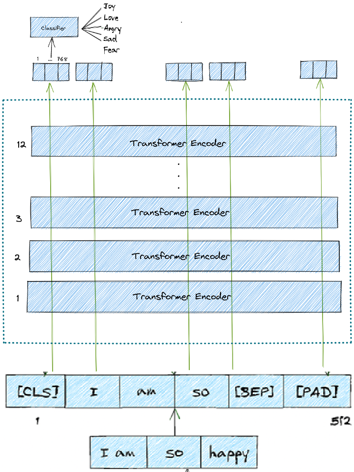
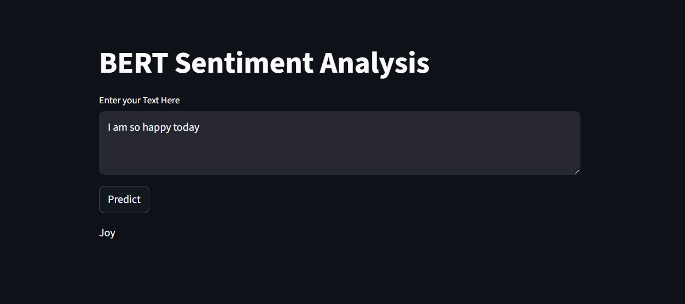

# 😃 Emotion Classification with BERT

This is a **Streamlit-based web application** that classifies user input text into **five emotion categories**: Joy, Fear, Love, Angry, and Sad.  
It provides an interactive interface where users can type or paste text and instantly receive the predicted **emotion label** using a fine-tuned **BERT model**.  

---

## 🛑 Problem Statement

Understanding human emotions in text is critical for businesses, customer support, and mental health monitoring. Traditional keyword-based approaches are:  

- **Inaccurate** – they fail to capture context and subtle emotional cues.  
- **Rigid** – cannot generalize well to unseen text variations.  
- **Limited** – struggle with polysemy (words with multiple meanings).  

This makes it difficult to:  

- Detect **true emotions** behind customer feedback, reviews, or conversations.  
- Automate **sentiment and emotional analysis** in real time.  
- Enhance applications such as **chatbots, voice bots, and social media monitoring tools**.  

---

## ✅ Solution Implemented

This project provides a **Streamlit-based Emotion Classification App** powered by **BERT (Bidirectional Encoder Representations from Transformers)**.  

- **Fine-tuned BERT model** (`bert-base-uncased`) on a labeled dataset with 5 emotions.  
- **Training handled via Hugging Face Trainer API**, with configurable `TrainingArguments`.  
- **Evaluation metrics**: Accuracy, Precision, Recall, F1-Score.  
- **Clean and interactive UI** where users can input sentences for prediction.  

The app predicts emotions in real time, helping businesses and researchers perform **faster, consistent, and accurate emotional analysis**.  

---

## 📊 Dataset Used

The dataset used for fine-tuning was based on **emotion-labeled text samples**, categorized into:  

1. **Joy**  
2. **Fear**  
3. **Love**  
4. **Angry**  
5. **Sad**  

The data was preprocessed, tokenized using **BERT Tokenizer**, and split into **training, validation, and test sets**.  

---

## 📸 Project Snapshots

Architecture Design

  
---

App Demo

  
---


🌐 Live Demo:  
👉 [Emotion Classification App]([https://emotion-classifier-5.streamlit.app/](https://huggingface.co/spaces/Bhunte25/emotion-classifier))  

---

## 🚀 Features

- Classifies text into **5 emotions**: Joy, Fear, Love, Angry, and Sad.  
- Fine-tuned **BERT model** for high accuracy.  
- Real-time predictions in a **clean, user-friendly Streamlit interface**.  
- Training with Hugging Face **Trainer + TrainingArguments**.  
- Model saved in **`artifacts/`** directory as `.safetensors`.  

---

## 📂 Project Structure

```
emotion-classifier/
│
├── artifacts/                  # Fine-tuned BERT model files (saved with save_pretrained or torch.save)
│
├── app.py                      # Main Streamlit application
│
├── experiment/                 # Notebooks, training logs, experiments
│   └── *.ipynb
│
├── README.md                   # Project documentation
├── requirements.txt            # Python dependencies

---

## ⚙️ Installation & Setup

1️⃣ **Clone the repository**  
```bash
git clone https://github.com/sumitjoshi10/emotion-classifier.git
cd emotion-classifier
```  

2️⃣ **Create a virtual environment** (recommended)  
```bash
python -m venv venv
source venv/bin/activate   # Mac/Linux
venv\Scripts\activate      # Windows
```  

3️⃣ **Install dependencies**  
```bash
pip install -r requirements.txt
```  

4️⃣ **Run the app**  
```bash
streamlit run app.py
```  

---

## 🧠 Model Details

- Model: **BERT (bert-base-uncased)**  
- Fine-tuned for **Sequence Classification** on 5 labels.  
- Saved using Hugging Face `Trainer.save_model()` → `.safetensors`.  
- Evaluation metrics show high performance across all emotion categories.  

---


## 🏗️ Training Pipeline
```
Data Collection
⬇️
Data Loader & Train-Test Split
⬇️
Tokenize the Dataset
⬇️
Model Building (Pretrained BERT Sequence Classification)
⬇️
Define Training Arguments
⬇️
Build Compute Matrix
⬇️
Initialize Trainer
⬇️
Fine-Tune Model
⬇️
Model Evaluation
⬇️
Save the Model
```
## 🤖 Prediction Pipeline

```
Load the Tokenizer
⬇️
Load the Model
⬇️
Tokenize the Text
⬇️
Generate the Prediction
⬇️
Display Prediction
```

---

## 🤝 Contributing

Contributions are welcome!  

1. Fork the repo  
2. Create a new branch (`feature/new-feature`)  
3. Commit your changes  
4. Push and open a Pull Request  
